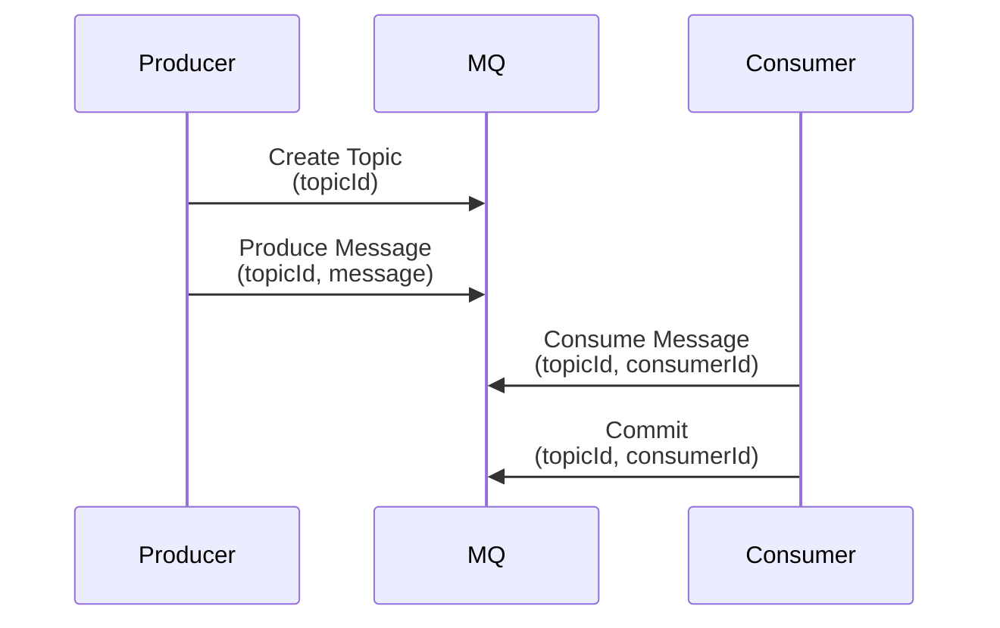

# Message Queue

2024-05-14 ~ 2024-07-16

# Cluster run command for dev environment

```bash
./gradlew bootRun --args='--server.port=8080 --node.id=1' # leader
./gradlew bootRun --args='--server.port=8081 --node.id=2' # follower
./gradlew bootRun --args='--server.port=8082 --node.id=3' # follower
```

# 프로젝트 개요

## 설계목표

- Exactly-once
    - Producer가 Event를 produce시, produce하고자 하는 Event는 topic에서 유일해야 함
    - Consumer가 Event를 consume시, 한 Event는 Consumer group에서 단 하나의 Consumer에게만 처리되어야 함
- Scalability
    - In-memory 환경에서 이벤트를 가능한 많이 보관할 수 있어야 함

## 주 기능

### API Spec

- health check
    - node 의  healthy 여부 확인하기 위해서 사용하는 API 입니다.
        - 동작방식
            - node 가 healthy 한 경우에 OK 로 응답합니다.
    - Method: GET
    - Path: /health
    - Query Parameter
        - N/A
    - Response (Content-type : text/plain)
        - OK
- create topic
    - MQ cluster에 토픽을 생성하는 API 입니다.
        - 동작방식
            - Master 인 경우
                - topic 이 어느 node 에 저장될 지 결정합니다.
                - 해당 node 에게 topic 생성 요청을 보냅니다.
            - Follower 인 경우
                - topic 생성 요청을 master 로 전달합니다.
    - Method: POST
    - Path: /topics
    - Request body (Content-Type: application/json)
        
        
        | Name | Type | Description |
        | --- | --- | --- |
        | topicId | String | topic id to be created |
- (internal) create topic in node
    - 특정 node에 topic 생성하는 API 입니다.
    - Method: POST
    - Path: /cluster/topic/create
    - Request body (Content-Type: application/json)
        
        
        | Name | Type | Description |
        | --- | --- | --- |
        | topicId | String | topic id to be created |
- consume
    - consumer 가 topic 에서 아직 읽지 않은 message을 가져오는 API 입니다.
        - 동작 방식
            - consumer 가 해당 topic 에서 마지막으로 읽은 message 의 다음 message 를 가져와서 전달합니다.
            - 만약, 아직 읽은 message 가 없다면 첫번째 message를 전달합니다.
            - 다음 message 가 존재하지 않는 경우 500 response status code 로 응답합니다.
    - Method: POST
    - Path: /consume
    - Request body (Content-Type: application/json)
        
        
        | Name | Type | Description |
        | --- | --- | --- |
        | topicId | String |  |
        | consumerId | String |  |
    - Response body (Content-Type: application/json)
        
        
        | Name | Type | Description |
        | --- | --- | --- |
        | id | UUID |  |
        | topicId | String |  |
        | body | String |  |
        | created | Long | unix timestamp |
- commit
    - consumer 가 topic 에서 마지막으로 읽어서 처리 완료한 message 을 읽음 상태로 변경하는 API 입니다.
    - Method : POST
    - Path : /commit
    - Request body (Content-Type: application/json)
        
        
        | Name | Type | Description |
        | --- | --- | --- |
        | topicId | String |  |
        | consumerId | String |  |
    - Response body (Content-Type: application/json)
        
        
        | Name | Type | Descritpion |
        | --- | --- | --- |
        | topicId | String |  |
        | consumerId | String |  |
        | message | String |  |
        | next | Integer | The next offset to be read |
    

# 시스템 아키텍처

## Sequence Diagram



## Components

### 클래스 구조


- 이 시스템이 stand-alone으로 구성되건, Cluster로 구성되건 간에, 모든 노드는 위와 같은 구성으로 동작합니다. 배포의 편의성과 구성의 단순함을 지키기 위해서 입니다.
- 기본 처리 단위는 Event 입니다. 따라서 이 시스템은 개념적으로 메세지-큐 라기보다는 이벤트-스트림이 더 적절하겠습니다.
- 한편, Topic은 Event를 저장하는 논리적인 저장 공간입니다. TopicManager를 통해 관리되며, OffsetManager를 통해 Commit이라는 행위를 할 수 있습니다.
- 향후 Node의 행위를 추출하여 stand-alone과 cluster 구성에서의 동작을 처리하는 객체를 분리하는 등 개선점은 산적해 있는 상태입니다.

### 분산환경


- Scalability 설계 목표 달성을 위해 위와 같은 설계로 진행하게 되었습니다.
- In-memory 환경에서 최대한 많은 Event를 저장하고 있는 것이 목표이기 때문에, 안정성과 trade-off 관계를 가지게 되었습니다.
- 즉 안정성을 위한 장치/설계에 필요한 공간을 모두 Topic과 Event를 위해 남김없이 사용합니다. 따라서 클러스터의 노드가 불의의 사고로 Crash를 맞는 경우, 해당 노드가 저장하고 있던 Topic의 Event들은 모두 유실되는 단점이 있습니다.
- 이를 해결하기 위해 추후 HA (High Availability)로 구성하도록 지원할 수도 있습니다. 혹은 적절한 Fault-tolerance 알고리즘을 통해 노드간 동기화를 적용하여 Failover 시나리오에 안정성을 부여할 수 있겠습니다.
- Fault tolerant한 합의 알고리즘을 선택하는 것과 커버할 Failover 시나리오를 선정하는 것 또한 설계의 일부이지만, 시간적 한계로 아쉽게도 여기까지 진행하진 못했습니다.

# 주차별 진행사항

## 초기 아이디어 회의

이번 스터디는 6명의 참가 인원으로 저번 스터디에 비해 인원이 2배로 늘었으며, 스터디를 시작하기전 아이디어 회의를 진행했습니다.

(회의의 흔적들)


회의 결과 Kafka와 같은 Distributed Message Queue 시스템을 설계하고 개발하기로 했습니다.

## 1주차

Message Queue를 미리 예습하여 공유하는 자리를 가졌습니다. 


예습한 내용을 바탕으로 스터디원들과 논의했을때 각자가 시스템에 대해 갖고 있는 생각이 조금씩 다르다는 것을 알게되었습니다. 현재 널리 사용되는 Distributed Message Queue 솔루션들은 기능이 너무 다양하기 때문에, 스터디원들끼리 합의된 선택과 집중의 대상을 정할 필요가 있었습니다.


위 사진은 스터디원들과 메세지 큐에서 제공하고 있는 기능들에 대한 리스트화를 진행하고 우선순위를 논의했던 회의 사진입니다.

다음 주차에는 가장 단순한 형태의 메시지 큐를 구현하고 스트레스 테스트부터 진행해보자는 야심찬 목표를 세우고 헤어졌습니다. 점진적으로 기능들을 추가하면서 발전할 시스템을 볼 생각에 모두가 흥분된 마음으로 귀가했던 기억이 있습니다.

## 2주차

2주차도 마찬가지로 주말에 예습을 해온 스터디원들의 공유로 시작했습니다. Spring 기반의 간단한 큐를 작성한 스터디원도 있었고, Spring을 사용하지 않은 분도 계셨습니다. Kotest라는 프레임워크를 사용해서 구현한 시스템을 테스트해오신 분도 계신 반면, JMH 툴을 사용해 성능 측정을 시도해보신 분도 계셨습니다.

예습을 해보니, 다같이 개발할 시스템의 기술스택을 정리할 필요성을 느꼈습니다. 현업에서는 기존에 사용하던 것 외의 기술을 사용하기가 어렵지만, 모두에게 새로운 기술을 탐구할 기회이기도 하니까요. 

프로그래밍 언어는 Java와 Kotlin 중에서 고민했습니다. Java는 Kotlin에 비해 오래된 언어이고 많은 스터디원들이 익숙했습니다. 반면, Kotlin은 젋은 언어이고 아직 사용해본적이 없는 스터디원도 있었습니다. Kotlin의 유연한 문법적 이점을 같이 탐구해보면 좋을 것 같아서 언어는 Kotlin으로 정했습니다.

서버 프레임워크는 Spring과 Ktor 중 고민했습니다. Spring은 엔터프라이즈 Java 개발 생태계에서 대표적인 서버 프레임워크로 모든 스터디원이 익숙했습니다. 반면, Ktor는 light-weight한 서버 프레임워크라서 모두가 현업에서 사용해본적이 없는 기술이었습니다. 위에서 언어를 Kotlin으로 선택한 만큼, Ktor까지 스터디를 하기에는 부담이 된다고 판단해 서버 프레임워크는 익숙한 Spring을 사용하기로 결정했습니다.

결정된 기술 스택으로 페어 프로그래밍을 통해 간단한 큐를 구현한 뒤, 성능 테스트를 진행했습니다. 성능 테스트는 JMeter를 사용해 로컬 컴퓨터에서 부하를 주었고, VisualVM을 통해 JVM의 지표를 모니터링 했습니다.

```bash
- enqueue, dequeue 최대 throughput (처리량)
    - user thread : 1,000
    - constant throughput per minute : 600
    - 2,000,000 저장 → heap 2GB 사용
    - 테스트 데이터
        - { “message” : “**Lorem Ipsum** is simply dummy text of the printing and typesetting industry. Lorem Ipsum has been the industry's standard dummy text ever since the 1500s, when an unknown printer took a galley of type and scrambled it to make a type specimen book. It has survived not only five centuries, but also the leap into electronic typesetting, remaining essentially unchanged. It was popularised in the 1960s with the release of Letraset sheets containing Lorem Ipsum passages, and more recently with desktop publishing software like Aldus PageMaker including versions of Lorem Ipsum.” }
```


## 3주차, 4주차


3주차에는 본격적인 설계 전에 상용 서비스 중인 몇 가지 메시지 큐를 조사했습니다. Kafka, RabbitMQ, ActiveMQ, Amazon SQS 등 여러 가지 메시지 큐 솔루션에 대해서 간단히 알아보고 비교해보는 시간을 가졌습니다. 결론적으로 **Kafka를 모델로 한 메시지 큐 시스템을 설계**하는 것으로 결정했는데요. 멤버 모두 사용해 본 경험이 있고 엔터프라이즈 레벨에서 많은 곳에서 꾸준히 사용하는 메시지 큐 솔루션 중 하나라는 점이 그 이유가 되었습니다.

그다음 **용어 정리(Terminology Alignment)** 과정을 통해 전체 시스템에서 사용할 용어와 그 뜻을 정리하는 시간을 가졌습니다. 이 과정을 통해 멤버 모두의 메시지 큐에 대한 이해도를 높이고 설계하면서 중요한 개념들을 정리해 미스 커뮤니케이션을 최소화하는 것을 기대했습니다. Kafka를 포함한 **여러 가지 시스템에서 사용하는 특정 개념에 붙이는 이름이 얼마나 고민 끝에 정해진 것인지 알 수 있었습니다.** 토픽 역할을 하는 개념을 왜 토픽이라고 이름 지었는지, 프로듀서 & 컨슈머 역할을 하는 개념을 왜 그렇게 지었는지 알겠더라고요 😂
시간을 들여 약 10가지의 용어에 대해서 정리했습니다.

4주차에는 3주차에서 정의한 용어 중 `topic`, `partition`, `offset`, `consumer group`에 대해서 팀 별로 역할을 나누어 구현을 시도했습니다. 제한된 시간 내에 일반적 Kafka의 특징과 제공하는 기능을 전부 구현한 메시지 큐를 만드는 것은 어려우므로 최대한 빠르게 메시지를 생산하고 소비할 수 있는 뼈대를 만드는 것에 집중했습니다.

## 5주차

(굉장히) 간단한 메시지 큐가 나온 상태에서 여러 컨슈머가 메시지를 소비할 때 발생할 수 있는 **동시성 이슈를 고려하는 설계와 이를 테스트할 수 있는 테스트 환경을 어떻게 만들 수 있을지**에 대해서 고민했습니다. 멀티 스레드로 같은 메시지 큐에 여러 개의 컨슈머가 메시지를 요청하는 시나리오를 **테스트 코드로 작성**해서 동시성 이슈가 발생하는 상황을 재현했습니다.

우선 메시지를 소비할 때 호출하는 로직을 `synchronized` 블록으로 감싼 뒤 테스트를 했고 동시성 이슈가 해결된 것을 확인했습니다. 하지만 실제 상용 메시지 큐가 이런 방법으로 동시성 이슈를 잡았다고 생각하지 않았습니다. 또 작성한 테스트 코드로는 많은 부하를 만들어 내기 어렵다고 판단했습니다. 그래서 JMeter, K6 등 부하 테스트 도구들에 관한 조사와 성능 측면에서 더 나은 동시성 제어 방법을 찾는 것을 병행했습니다.

## 6주차

5주차까지는 매주 주제를 하나씩 그때그때 정해서 모든 멤버가 다같이 Mob Programming을 진행하는 방식을 택했으나, 이 방식이 진행이 느려지게 만든다는 피드백이 많아서 논의를 진행하였습니다. 

논의 결과 매주 점진적으로 개선점을 찾는 것 보다는, 최종 구현 목표를 설정하고 해당 스펙을 완성하기 위해서 진행하는 방향이 좋겠다는 방향으로 의견이 모아졌습니다. 

최종 구현 목표를 설정하기 위해서 기존에 브레인스토밍했던 주제들 중에서 가장 중요한 2가지를 선정하였습니다. 

- Commit 기능과 Exactly-Once Consuming
- 처리량 개선을 위한 분산 환경

향후에는 속도를 높이기 위해서 2~3개의 팀이 각자 Task를 맡아서 진행하는 것으로 방식을 변경하였습니다. 

최종 목표로 선정한 기능을 만족하기 위한 전체 시스템 설계를 진행하였습니다. 


## 7주차 ~ 9주차

커밋기능, 분산환경에 대해서 2팀으로 나누어서 논의 및 페어 프로그래밍을 진행하였습니다. 진행 도중에 논의하여 결정한 주요 설계사항은 아래와 같습니다. 

- 커밋기능 팀
    - Exactly-Once는 Consumer에게만 보장하는 것으로 결정하였습니다.
        - Producer의 개수나 구성에 대해서 Message Queue 시스템은 알지 못해도 괜찮아야 함
        - Unique한 메시지 ID를 첨부하여 Producer 측에서는 중복 문제를 해결 가능
- 분산환경 팀
    - Topic, Message 라우팅에 대한 역할을 하는 컴포넌트를 별도로 구성하지 않고, 동질적인 Node 집합에서 Leader로 선정된 노드가 역할을 담당하는 것으로 결정하였습니다.
        - Single Point of Failure 방지
        - 동질적인 Node로 Cluster를 구성할 경우 배포의 용이성
    - Leader가 Follower 노드에 대해서 Health Check를 수행하여 현재 정상 상태인 Node에 대해서만 Topic을 배분할 수 있도록 구성하였습니다.

## 10주차

9주차까지 각 팀에서 개발한 기능을 통합하고 테스트하였습니다. 분산 환경에서 의도한대로 토픽 생성, 메시지 Producing, Message Consuming 기능의 동작을 체크하였습니다. 

- 환경
    - M3 Pro Macbook
    - 1 Master Node
    - 2 Follower Node
- 기능
    - Topic 생성과 분배
    - Message Producing과 라우팅
    - Message Consume, Commit 처리

<Leader x 1 & Follower x 2 환경에서 테스트하는 스크린샷>


# 회고

## 서용준

- 상용 도구의 내부 구조를 고민해보고 직접 구현해보는 게 예전에 자료구조를 직접 구현해보던 느낌과 비슷하게 신선하고 좋았습니다.
- 어느 요구사항까지 개발할지 초기에 정해두지 않아서 그런지 마지막에 목표가 좀 흐릿해지는 느낌이 들어 아쉬웠습니다.
- 마지막 쯤에 개발했던 기능을 잠깐 리팩토링 해봤는데, 하다보니 애플리케이션 아키텍처에 관한 내용도 다뤄보면 좋겠다는 생각을 했습니다. 생각한 대로 구조가 바뀌니까 만족스러웠습니다.

## 이요셉

- **아쉬운점 (배운점)**
    - 왜 유명한 오픈소스들에서 Concept 문서가 꽤나 상단에 위치하는지 알겠다 (kafka도 그렇다)
    - 여러 사람이 동시에 작업하는 환경에서 개념적 합의와 통일은 코드의 일관성과도 이어진다는 것을 배웠다.
    - 뭔가 조금 더 본격적인 개발 프로젝트처럼 진행되었어야 했을 것 같다. 개발 마스터가 교통정리 싹 해주고, 기능 붙일 수 있게 와꾸도 잡아놓고 했으면 더 빠르고 효율적으로 진행되었을 것 같다.
- **좋았던점**
    - 시간을 조금 더 사용했지만 목표를 조절하고 마무리까지 한 것.
    - Kotlin 사용 솔직히 아직 초보 단계인데, 고수들 코드 짜는 흐름(멘탈모델)을 옆에서 봐서 배웠다. 스프링도 마찬가지.
    - Message와 Event의 차이를 구분해보려고 했던 것을 포함해서, 메세지 큐(이벤트 스트림)의 개념적인 수준에서 깊은 이해가 생긴 것 같다.
    - 다들 바쁘고 피곤하지만, 끈기 있게 진행된 것이 좋았습니다. 많이 배웁니다 여러분.
- **미안한점**
    - 말한거에 비해 기여를 못했다. Too much 훈수, 미안하다!
    - 주차별 로드테스트를 강하게 주장했던만큼, 그건 내가 했었어야 했다고 생각이 든다. 미뤄서 미안하다!

## 김용준

- 카프카가 단순한 큐가 아닌 정말 많은 기능이 존재하는 복잡하고 정교한 시스템이라는 것을 알게되었습니다.
- 개인적으로 JMH, Disruptor와 같은 툴들을 적용해 성능을 비교해보았는데, 많은 것을 배울 수 있었습니다. 실제 프로젝트에는 적용하지 못한 부분이 아쉽습니다.
- 소프트웨어 설계시에 요구사항 분석, 관계도 분석 이외에도 용어 정의가 중요하다는 것을 배웠습니다. 학창시절에 전교 1등하던 친구에게 공부의 비결을 물어봤던 것이 기억이 나네요. 사소한 용어의 정의도 그냥 넘어가지 않는것이 중요한 것 같다는 그 친구의 답변이 비단 공부 뿐만 아니라 개발 협업시에도 적용할 수 있는 소중한 팁 같습니다.

## 하재형

- 구현하기 위해서 설계하는 과정이 정말 즐거웠습니다.

## 이석재

- 재밌었어요 🙂
- 카프카 비스무리한 것을 설계하고 개발해보니 카프카의 대단함을 느낄 수 있었습니다 👍

## 신준수

- 브레인스토밍을 하면서 다양하고 흥미로운 아이디어들이 많았는데, 시간의 제약 상 모든 주제를 진행하지 못해서 아쉬웠습니다.
- 기초적이지만 분산 환경에서 Leader, Follower 개념을 구현해볼 수 있어서 좋았습니다.
- 다양한 메시지 큐 중에서 Kafka에서 많은 개념을 차용했는데, 개인적으로 Kafka가 아직은 익숙하지 않아서 개념들을 완벽하게 이해하는데 어려움이 있었던 것 같습니다. 향후에 스스로 Kafka에 대해서 한번 제대로 배우는 시간을 가져야겠다는 생각이 들었습니다.
- 저번 스터디에 비해서 유저 서비스가 아니라서 그런지, 팀원들 동기 부여를 제대로 못해드린 것 같아서 미안하고 아쉽습니다.
